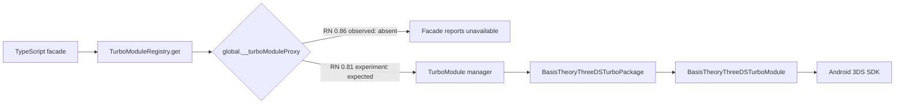

# Android TurboModule runtime investigation

## Purpose

This document records why the Android-only bare React Native host uses RN
0.81.5 even though the Expo TurboModules POC uses RN 0.86.3. It is an
evidence-driven compatibility experiment, not a recommendation to pin a future
production SDK to RN 0.81.

The question is deliberately narrow: can the standard React Native Codegen
TurboModule contract expose the Android 3DS adapter to JavaScript? The Android
3DS SDK, tokenization flow, merchant backend, TypeScript spec, and Kotlin
adapter are held constant between the two hosts.

## What was observed with RN 0.86.3

Both the Expo host and the initial bare React Native CLI host used RN 0.86.3.
The bare host did not use Expo and registered
`BasisTheoryThreeDSTurboPackage` directly in `MainApplication.kt`.

Native Logcat proved that the Kotlin module was present in the installed app:

```text
Registering NativeBasisTheoryThreeDS TurboModule
Creating NativeBasisTheoryThreeDS TurboModule
NativeBasisTheoryThreeDS TurboModule initialized
```

The JavaScript facade recorded the opposite result at runtime:

```text
available: false
legacyModuleRegistered: true
bridgeless: true
turboModuleProxyAvailable: false
```

This rules out several tempting explanations:

- It is not a missing API key or local backend. Lookup occurs before any 3DS
  request.
- It is not a Ravelin or Basis Theory Android SDK dependency failure. The
  Kotlin adapter instantiated successfully.
- It is not merely Expo autolinking. The same result occurred in a bare host
  that adds the package itself.
- It is not corrected by a Metro reload. The missing value is a native JSI
  runtime binding compiled into and installed by the host.

The startup `ReactNoCrashSoftException` about window focus arriving before a
React context was ready is separate. It is logged before the package registers
and is not the reason `__turboModuleProxy` is absent.

## Why RN 0.81.5 is the next experiment

RN 0.81.5 still supports the New Architecture and standard Codegen
TurboModules. Its official Android template uses `DefaultReactNativeHost` and
derives a `ReactHost` from it. This POC adopts that template pattern while
keeping `newArchEnabled=true`.



The version change is meaningful because it changes the React Native runtime
and host initialization path. It does not change the public TurboModule API or
the 3DS behavior. If RN 0.81.5 succeeds, the POC establishes that the adapter
is viable and that RN 0.86.3's Android runtime needs a separate compatibility
investigation before adoption.

The Android 3DS SDK is included as a Gradle composite build. A composite build
cannot mix AGP versions, so the RN 0.81 host uses its own ignored local SDK
checkout at `poc-support/.native-sdks/android-threeds-turbo-modules-rn081`.
That checkout contains the same `android-threeds@1.2.1` source as the other
hosts, but receives an AGP 8.11.0 build catalog. This prevents an AGP 8.11.0 /
8.12.0 resolution conflict without publishing or changing the native SDK.

## Files that implement the experiment

| Responsibility | File | Why it matters |
| --- | --- | --- |
| RN baseline | `poc-examples/turbo-modules-android-bare/package.json` | Pins RN 0.81.5 and the matching React, Metro, Babel, and CLI packages. |
| New Architecture flag | `poc-examples/turbo-modules-android-bare/android/gradle.properties` | `newArchEnabled=true` is required for a real TurboModule experiment. |
| Official host pattern | `poc-examples/turbo-modules-android-bare/android/app/src/main/java/com/bt3dsturbobareandroid/MainApplication.kt` | Supplies the package list to `DefaultReactNativeHost`, then creates the bridgeless `ReactHost`. |
| Package registration | `android/src/main/java/com/basistheory/reactnativethreeds/BasisTheoryThreeDSTurboPackage.kt` | Advertises `NativeBasisTheoryThreeDS` as a TurboModule and creates its Kotlin implementation. |
| Codegen source of truth | `src/specs/NativeBasisTheoryThreeDS.ts` | Generates the Android base class that the Kotlin adapter implements. |
| Runtime diagnostic | `src/native/BasisTheoryThreeDSTurbo.ts` | Logs whether JS can resolve the generated module and which RN host capability is missing. |

## Original acceptance criteria and observed result

Start the local backend and the bare host Metro process in separate terminals:

```sh
yarn poc:backend
yarn poc:turbo-modules-android-bare
```

Open the Android project through the launcher, select JDK 21 as the Gradle JDK,
and run the `app` configuration:

```sh
./poc-support/scripts/open-android-studio.sh turbo-modules-android-bare
```

Because this experiment changes the React Native and Gradle wrapper baselines,
fully quit Android Studio before opening the launcher. If Android Studio offers
to update the daemon JVM, decline it; select the installed JDK 21 as the Gradle
JDK instead. The project wrapper is Gradle 8.14.3 for this RN 0.81 host.

The original success condition was that the initial screen report the
TurboModule as ready and Logcat show
the native registration lines and a JavaScript registry diagnostic with both
of these values:

```text
turboModuleProxyAvailable: true
available: true
```

Only after that condition would the POC validate a frictionless card
(`4200000000000002`) and a challenge card (`4200000000000004`, OTP `1234`).
The condition was not met, so no Android TurboModule card scenario was run.
The bare app's `AUTHENTICATION_ENDPOINT` remains
`http://10.0.2.2:3333/3ds/authenticate` for future reproduction; Android
emulators use `10.0.2.2` to reach the host machine.

## Decision after the experiment

The RN 0.81.5 host produced the same outcome as RN 0.86.3. Its native logs
confirmed `useTurboModules=true` plus module registration, creation, and
initialization. JavaScript nevertheless reported
`turboModuleProxyAvailable: false`. The bare app retried the lookup for two
seconds after its first JavaScript frame, so this is not a startup race.

The standard Java/Kotlin Codegen TurboModule route is therefore **not
demonstrated as viable on Android** by this POC. This is a runtime exposure
problem, not a 3DS integration error.

## External references

The expected implementation model is React Native's documented sequence:
define a typed spec, run Codegen, implement the generated native interface,
and expose it to the runtime. The following documents describe that contract:

- [React Native: Native Modules introduction](https://reactnative.dev/docs/turbo-native-modules-introduction)
- [React Native: Using Codegen](https://reactnative.dev/docs/the-new-architecture/using-codegen)

There are also public reports with a closely related runtime symptom. In
[Expo issue #45926](https://github.com/expo/expo/issues/45926), an Expo SDK 54
/ RN 0.81 bridgeless application has Codegen and native installation evidence,
yet `global.__turboModuleProxy` is `null` and `TurboModuleRegistry` cannot
resolve the native module. Its linked downstream reproduction,
[react-native-view-shot issue #653](https://github.com/gre/react-native-view-shot/issues/653),
reports the same inability to reach a native Codegen module from JavaScript in
that runtime configuration.

These reports are corroborating evidence, not a diagnosis of this POC. They
use different modules and host setups, and one is iOS-specific. Independently,
this POC reproduced the missing JavaScript proxy on Android in both its Expo
RN 0.86.3 host and its bare RN 0.81.5 host. The public reports justify treating
the behavior as an ecosystem/runtime compatibility concern rather than assuming
that the 3DS adapter itself is at fault.

### How generic Bridgeless guidance applies here

Some Bridgeless troubleshooting guidance correctly recommends keeping native
module access through a stable module object rather than spreading or
destructuring it, and checking that the native package is registered. Neither
condition explains this result:

- The POC calls methods on the module object returned by its Codegen facade; it
  does not spread or destructure native methods.
- Logcat proves that `BasisTheoryThreeDSTurboPackage` registers and creates the
  Kotlin module, and the RN 0.81.5 bare host logs `useTurboModules=true`.

It is misleading to describe a missing `__turboModuleProxy` as an expected
removal of the TurboModule lookup mechanism in every modern Bridgeless host.
The official React Native contract still relies on a Codegen-defined module
being made reachable from JavaScript, and the public Expo report above records
the same failed reachability. Direct JSI bindings are a possible separate
implementation strategy, not a configuration switch that makes this standard
Codegen TurboModule available.

- Keep Bridge and WebView as the Android options. Both have already completed
  native 3DS validation in this POC.
- Keep the Codegen TurboModule implementation and its successful iOS result as
  useful design work, but do not present it as an Android integration path.
- Do not mark the module as legacy merely to make it appear through
  `NativeModules`: that would validate bridge interop, not a TurboModule.
- A future investigation can build a minimal RN reproduction for upstream, or
  assess a direct JSI binding. The latter would bypass `TurboModuleRegistry`
  with a custom C++ binding, JNI/Kotlin on Android, and Objective-C++/Swift on
  iOS. It is feasible but has materially higher implementation and maintenance
  cost, so it must be a separate cross-platform POC rather than a small patch
  to this Codegen implementation. `docs/ARCHITECTURE.md` compares the options.
