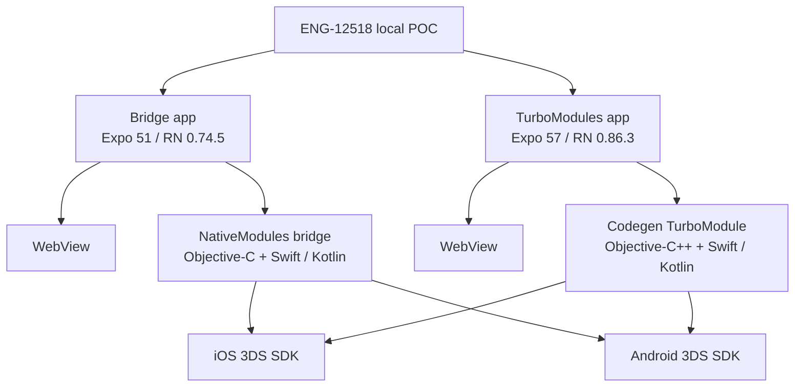
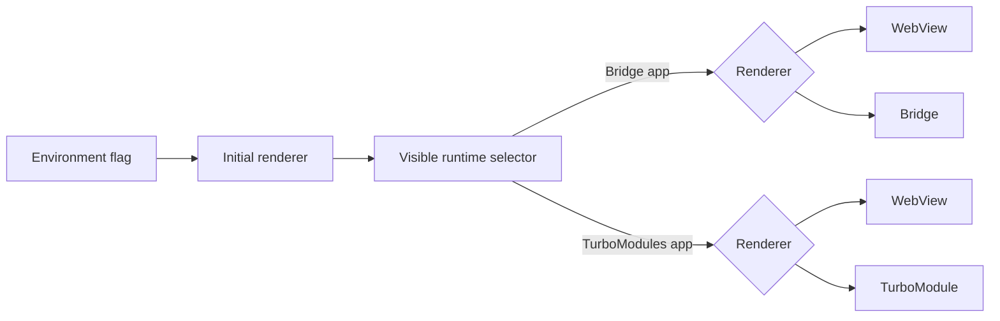
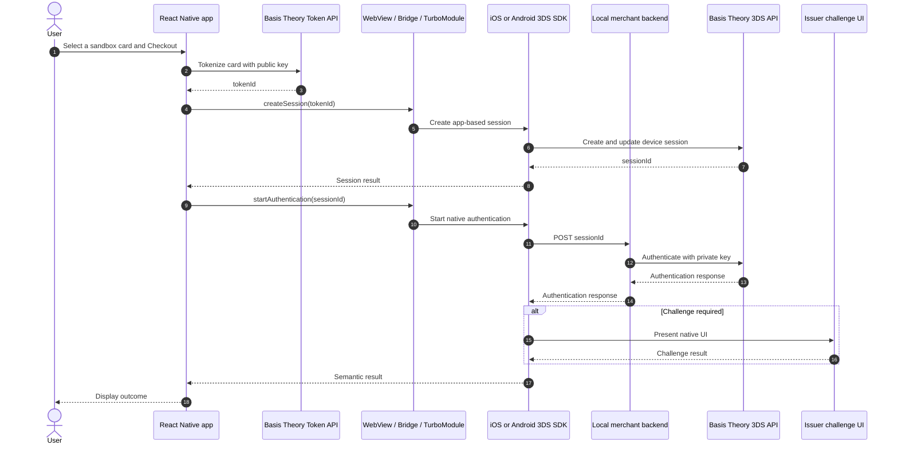
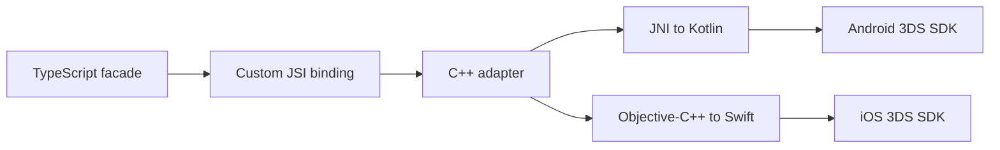
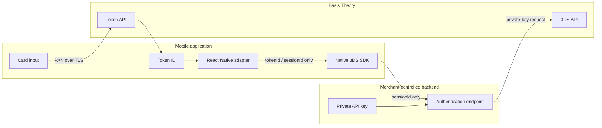

# Architecture and feasibility

## Question answered

ENG-12518 asks whether React Native can drive the native Basis Theory 3DS SDK
instead of rendering every challenge through the existing WebView integration.
This POC answers that question for iOS and Android and compares two React Native
native-module generations without measuring checkout abandonment.

The apps intentionally keep WebView and native paths side by side. This makes
the renderer the primary variable while tokenization, the merchant backend,
test cards, and semantic outcomes remain comparable.

## Why there are two POC apps

React Native 0.74 is retained because it is the baseline on which the original
Bridge POC was proven and it avoids an unrelated `fmt` incompatibility between
newer legacy React Native dependencies and Apple Clang 21. React Native 0.86 is
the current host used for the production-oriented TurboModule experiment.

## Runtime renderer selection

The environment variables select only the initial value. The UI owns the
runtime choice, displays the active renderer, and disables the selector during
checkout so one transaction cannot cross two implementations. Bridge and
TurboModule remain in separate binaries because their applications intentionally
exercise different React Native architectures.

## Shared transaction flow

The WebView branch differs after session creation: JavaScript calls the same
merchant backend and the web SDK presents the browser challenge. The private
key stays in the backend for every branch.

## Native integration options

| Concern | Bridge | Codegen TurboModule | Direct JSI binding |
| --- | --- | --- | --- |
| JS/native contract | Handwritten TypeScript and native signatures | TypeScript spec is the source of truth | Handwritten TypeScript and C++ binding contract |
| Native glue | Objective-C export macros and Kotlin `@ReactMethod` | Generated protocols/classes plus thin adapters | C++ binding plus JNI on Android and Objective-C++ on iOS |
| JS/native lookup | `NativeModules` bridge | `TurboModuleRegistry` / host TurboModule runtime | A custom JSI global or host object installed by native code |
| Build-time mismatch detection | Limited | Codegen catches unsupported or mismatched types | Custom C++ and TypeScript contract; no automatic Codegen enforcement unless added separately |
| Status in this POC | Validated on iOS and Android | Validated on iOS; Android runtime lookup is unavailable | Not implemented; proposed only as a follow-up experiment |
| Main benefit | Lowest implementation and maintenance risk | Typed contract and native interfaces generated from one spec | Does not depend on `TurboModuleRegistry` being exposed by the host |
| Main cost | Bridge compatibility path and handwritten contract | Depends on the host correctly exposing the TurboModule runtime | Highest complexity: runtime installation, C++/JNI/Objective-C++, threading, lifetime, error, and promise handling |

Codegen is a translator: it reads the TypeScript `Spec` and creates the native
interface that Swift/Objective-C++ and Kotlin must implement. It does not write
the 3DS business logic. That remains in the Basis Theory platform SDKs.

### Direct JSI as a future experiment

A direct JSI binding would keep the public TypeScript operations (`configure`,
`createSession`, and `startAuthentication`) but route them through a custom
native JSI binding rather than `TurboModuleRegistry`:

This is feasible on both platforms, but it is not a different invocation syntax
for the current TurboModule. Native code must install the binding when the JSI
runtime is created. On Android, that means a deliberately designed C++/JNI
integration; on iOS, C++/Objective-C++ must safely invoke the Swift adapter.
It also requires explicit lifecycle, threading, exception-to-JavaScript-error,
and asynchronous-result handling.

It should be evaluated in its own `direct-jsi` POC without replacing the
validated Bridge POC or the iOS TurboModule. Expo Go cannot load such custom
native code; the experiment needs a development build/prebuild or a bare host.

## Security boundary

PAN, CVV, OTP, and the private API key are excluded from both native-module
contracts. `PUBLIC_API_KEY` belongs in each mobile `.env`; `BT_API_KEY_PVT`
belongs only in the local backend `.env`.

## Honest recommendation

The bridge is technically viable and is the validated Android native path in
this POC. The Codegen TurboModule contract is validated on iOS, but its standard
Java/Kotlin implementation is not yet viable on Android because JavaScript
cannot resolve the runtime proxy in either Android host tested. Keep Bridge and
WebView as Android options; retain the typed TurboModule contract as an iOS
implementation and future Android-investigation target. Do not promise a
cross-platform TurboModule SDK until Android runtime exposure is demonstrated.
If avoiding the Bridge becomes a product requirement, fund direct JSI as a
separate cross-platform experiment rather than treating it as a small
TurboModule workaround. See `docs/ANDROID-TURBOMODULE-INVESTIGATION.md` for
evidence and external references.
