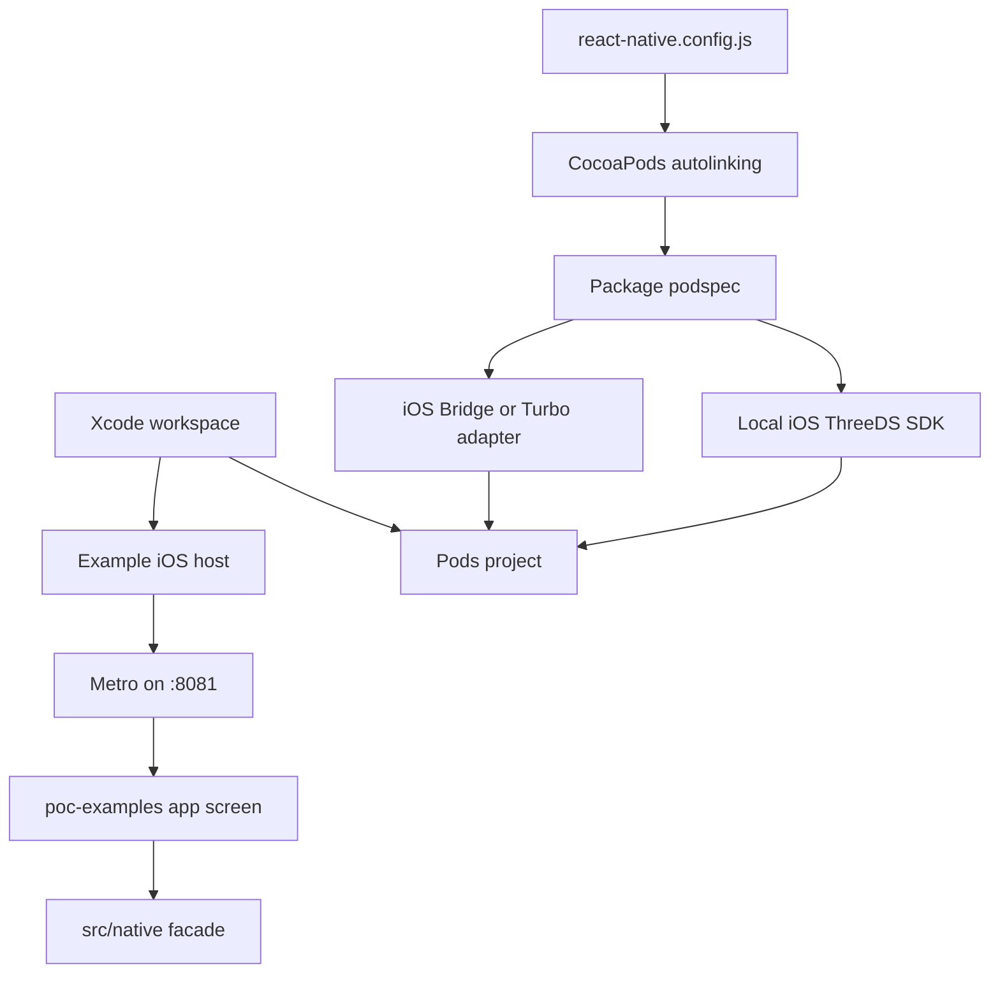
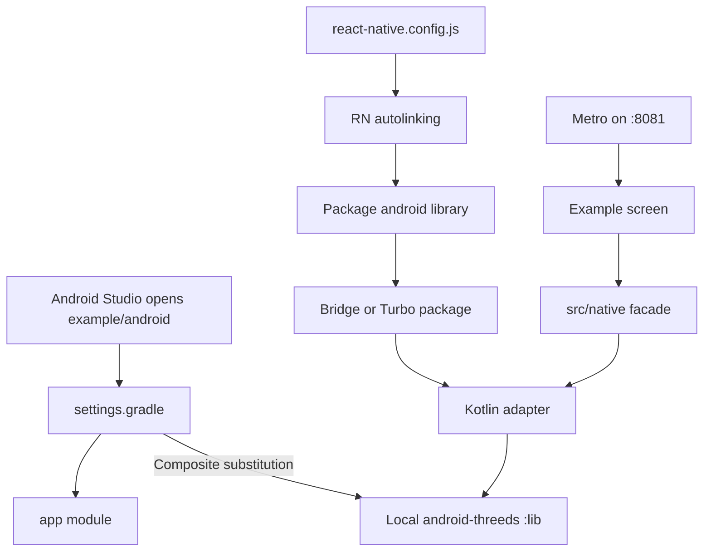

# Code map and extension guide

## Start here

| Purpose | Bridge | Expo TurboModules | Bare Android TurboModules |
| --- | --- | --- |
| Checkout and renderer UI | `poc-examples/bridge/src/App.tsx` | `poc-examples/turbo-modules/src/App.tsx` | `poc-examples/turbo-modules-android-bare/App.tsx` |
| WebView implementation | `src/BasisTheory3dsProvider.tsx` | `src/BasisTheory3dsProvider.tsx` | Not included by design |
| JavaScript native facade | `src/native/BasisTheoryThreeDS.ts` | `src/native/BasisTheoryThreeDSTurbo.ts` | `src/native/BasisTheoryThreeDSTurbo.ts` |
| Native contract | Handwritten TypeScript interface | `src/specs/NativeBasisTheoryThreeDS.ts` | `src/specs/NativeBasisTheoryThreeDS.ts` |
| Android host registration | `BasisTheoryThreeDSBridgePackage.kt` | `BasisTheoryThreeDSTurboPackage.kt` | `poc-examples/turbo-modules-android-bare/android/app/src/main/java/com/bt3dsturbobareandroid/MainApplication.kt` |
| Android implementation | `BasisTheoryThreeDSBridgeModule.kt` | `BasisTheoryThreeDSTurboModule.kt` | `BasisTheoryThreeDSTurboModule.kt` |

Android sources share
`android/src/main/java/com/basistheory/reactnativethreeds`. The build selects
only the adapter needed by the example's `newArchEnabled` value. The podspec
does the equivalent selection using `RCT_NEW_ARCH_ENABLED`.

## How the example hosts consume this package

Each folder below `poc-examples` is a complete executable app. The package root
contains the reusable JavaScript and native adapters:

```text
react-native-threeds/
├── src/                         # Shared WebView API and native facades
├── ios/                         # Bridge and TurboModule iOS adapters
├── android/                     # Bridge and TurboModule Android adapters
├── BasisTheoryReactNativeThreeDS.podspec
├── poc-examples/
│   ├── bridge/                  # RN 0.74 executable host
│   └── turbo-modules/           # RN 0.86 executable host
│   └── turbo-modules-android-bare/ # RN 0.81 CLI Android-only TurboModule host
└── poc-support/
    ├── backend/                 # Local merchant authentication endpoint
    ├── ios/                     # Local-only CocoaPods shim
    └── scripts/                 # Setup and Android Studio launchers
```

Both example manifests depend on the package through `workspace:*`.
`react-native.config.js` points autolinking at the repository root and chooses
the correct Android package registration class.

### iOS load path



The example `Podfile` sets its architecture before autolinking. The package
podspec then compiles either the Objective-C Bridge registration plus Swift
implementation, or the Objective-C++ Codegen adapter plus Swift implementation.
This is why Xcode must open the `.xcworkspace`.

### Android load path



The host's `settings.gradle` substitutes
`com.basistheory:android-threeds:1.2.1` with the ignored local SDK checkout.
Nothing needs to be published to test the package branch.

The bare host performs the same substitution in
`poc-examples/turbo-modules-android-bare/android/settings.gradle`, then adds
`BasisTheoryThreeDSTurboPackage` in its `MainApplication.kt`. Its RN 0.81
`DefaultReactNativeHost` creates the `ReactHost`, rather than using Expo's
`ExpoReactHostFactory`, so it isolates the Android runtime that publishes the
TurboModule binding. The reason for this RN baseline is documented in
`docs/ANDROID-TURBOMODULE-INVESTIGATION.md`.

## Bridge and TurboModule call chains

```text
Bridge app
  App.tsx -> BasisTheoryThreeDSNative -> NativeModules.BasisTheoryThreeDS
  -> Objective-C/Swift or ReactPackage/Kotlin -> platform ThreeDS SDK

TurboModules app
  App.tsx -> BasisTheoryThreeDSTurbo -> TurboModuleRegistry
  -> generated NativeBasisTheoryThreeDSSpec
  -> Objective-C++/Swift or BaseReactPackage/Kotlin -> platform ThreeDS SDK

Bare Android TurboModules app
  App.tsx -> BasisTheoryThreeDSTurbo -> TurboModuleRegistry
  -> generated NativeBasisTheoryThreeDSSpec
  -> DefaultReactNativeHost / BaseReactPackage / Kotlin -> Android ThreeDS SDK
```

Codegen is a translator. It reads the TypeScript `Spec` and creates the native
protocol/base class that the iOS and Android adapters must implement. It does
not implement 3DS behavior; the platform SDK remains responsible for sessions,
device collection, authentication, and challenge presentation.

To add a TurboModule method, update the TypeScript spec first, regenerate
Codegen, implement both generated native signatures, expose the operation in
the JavaScript facade, and add contract tests.

## Renderer selector ownership

The selector intentionally belongs to each POC app rather than the reusable
SDK. Its environment flag chooses the initial renderer, the UI displays the
active renderer, and checkout disables the selector to keep one transaction on
one implementation.
