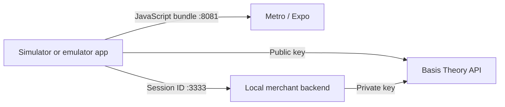

# Local setup and runbook

Run every command below from the root of `react-native-threeds` unless the
command changes directory explicitly.

## Repository layout

| POC app | React Native baseline | iOS workspace | Android project |
| --- | --- | --- | --- |
| Bridge | Expo 54 / RN 0.81.5 | `poc-examples/bridge/ios/BT3DSBridgePOC.xcworkspace` | `poc-examples/bridge/android` |
| TurboModules | Expo 57 / RN 0.86.3 | `poc-examples/turbo-modules/ios/BT3DSNewArchitecturePOC.xcworkspace` | `poc-examples/turbo-modules/android` |
| TurboModules bare Android | RN 0.81.5 / React Native CLI | Not applicable | `poc-examples/turbo-modules-android-bare/android` |

The historical Xcode target names remain inside the generated host projects;
the descriptive folder names are the stable entry points for the POC. Always
open the `.xcworkspace`, not the `.xcodeproj`, because CocoaPods owns React
Native, the adapter, and the iOS 3DS SDK dependencies.

## 1. Prepare dependencies

Install JavaScript dependencies from the repository root:

```sh
yarn install
```

Prepare source-only native SDK checkouts:

```sh
./poc-support/scripts/setup-native-dependencies.sh
```

The script checks out `ios-threeds` and three isolated `android-threeds` v1.2.1
copies below the ignored `poc-support/.native-sdks` directory. It also installs
a local CocoaPods packaging shim and a checksum-verified Ravelin XCFramework.
It does not modify, publish, commit, or push either native SDK repository.

The backend is also a workspace, so the root installation prepares all three
runtime projects.

Install Pods for both iOS hosts:

```sh
cd poc-examples/bridge/ios
bundle exec pod install || pod install
cd ../../turbo-modules/ios
bundle exec pod install || pod install
cd ../../..
```

## 2. Configure environment files

Copy each example file and provide the public mobile application key:

```sh
cp poc-examples/bridge/.env.example poc-examples/bridge/.env
cp poc-examples/turbo-modules/.env.example poc-examples/turbo-modules/.env
cp poc-examples/turbo-modules-android-bare/.env.example poc-examples/turbo-modules-android-bare/.env
cp poc-support/backend/.env.example poc-support/backend/.env
```

Bridge mobile configuration:

```dotenv
PUBLIC_API_KEY=<public flock-dev application key>
API_BASE_URL=https://api.flock-dev.com
SCRIPT_SRC=https://3ds.basistheory.com
USE_NATIVE_3DS=true
AUTHENTICATION_ENDPOINT=http://localhost:3333/3ds/authenticate
```

The TurboModules app uses the same values, with `USE_TURBO_3DS=true` as its
initial renderer flag. Set the flag to `false` to start with WebView. Both apps
also display a runtime selector, so the renderer can be changed without editing
the file or restarting Metro.

Only `BT_API_KEY_PVT` belongs in `poc-support/backend/.env`. Never place that
private key in either mobile example.

The bare Android host uses only `PUBLIC_API_KEY`, `API_BASE_URL`, and
`AUTHENTICATION_ENDPOINT`. It has no WebView selector because its purpose is to
exercise only the Codegen TurboModule path.

Use the correct authentication host for the runtime:

| Runtime | `AUTHENTICATION_ENDPOINT` |
| --- | --- |
| iOS simulator | `http://localhost:3333/3ds/authenticate` |
| Android emulator | `http://10.0.2.2:3333/3ds/authenticate` |
| Physical device | `http://<MAC_LAN_IP>:3333/3ds/authenticate` |

## 3. Start all three runtime pieces

The merchant backend, Metro, and the native host are independent processes:



Terminal 1 — backend:

```sh
yarn poc:backend
```

Terminal 2 — Metro for exactly one example:

```sh
yarn poc:bridge --clear
```

For TurboModules, use `yarn poc:turbo-modules --clear` instead. These root-level
commands avoid the earlier ambiguity where `yarn start` was run in a directory
without a `start` script. Only one Metro process should own port `8081`.

For the bare Android TurboModule host, use this separate Metro command instead:

```sh
yarn poc:turbo-modules-android-bare
```

Do not run the Expo and bare-host Metro commands simultaneously; they both use
port `8081`.

The TurboModules Metro configuration deliberately resolves `react` and
`react-native` from `poc-examples/turbo-modules/node_modules`. The workspace
root retains React Native 0.74 for the Bridge POC; resolving it from a linked
library source would otherwise make the TurboModule registry incompatible with
the RN 0.86 native app.

Codegen keeps its canonical `TurboModuleRegistry.get` declaration in the spec.
The TurboModule facade also logs the native-registry state so the POC can tell
whether a failure is caused by module registration or by the React Native host.

### Android TurboModule limitation in this POC

Expo 57.0.22 / React Native 0.86.3 on Android runs bridgeless but can omit
`global.__turboModuleProxy`. The original bare RN 0.86.3 host produced the
same result even though it registered, created, and initialized
`BasisTheoryThreeDSTurboPackage`. A real Codegen TurboModule therefore cannot
be resolved from JavaScript. The diagnostic has this characteristic shape:

```text
bridgeless: true
turboModuleProxyAvailable: false
available: false
```

This is not fixed by re-running Metro, rebuilding the APK, setting
`USE_TURBO_3DS`, or changing 3DS credentials. Those actions are still required
for normal application changes, but they cannot install the missing runtime
binding. The Android Bridge renderer remains validated in this Expo host, and
the iOS TurboModule renderer remains validated.

`poc-examples/turbo-modules-android-bare` now uses RN 0.81.5 and the official
`DefaultReactNativeHost` pattern as a separate compatibility experiment. It
uses the exact same TypeScript Codegen spec and Kotlin adapter, so a successful
manual run isolates the RN 0.86 Android runtime as the variable rather than the
3DS implementation. It produced the same missing-proxy result, even with
`useTurboModules=true` and a two-second retry. See
`docs/ANDROID-TURBOMODULE-INVESTIGATION.md` for the observed logs and final
scope decision, React Native's expected Codegen model, and links to related
public Expo and community-library runtime reports.

Process 3 — native host:

- iOS: open the desired workspace from the table and press Run in Xcode.
- Android: fully quit Android Studio, then run
  `./poc-support/scripts/open-android-studio.sh bridge` or
  `./poc-support/scripts/open-android-studio.sh turbo-modules`.
- Bare Android TurboModules: fully quit Android Studio, then run
  `./poc-support/scripts/open-android-studio.sh turbo-modules-android-bare`.
  Open the `app` configuration, select an emulator, and press **Run**.

### Create an Android emulator

Android Studio supplies the emulator; no separate download is needed. Open the
desired POC through the launcher, then use **Tools > Device Manager**. Select
**Create device**, choose a Phone profile such as Pixel, select a downloaded
system image (prefer a Google APIs image), and finish the wizard. Start that
virtual device from Device Manager, select it in Android Studio's device picker,
and press **Run** for the `app` configuration.

For an Android emulator, keep
`AUTHENTICATION_ENDPOINT=http://10.0.2.2:3333/3ds/authenticate`: `10.0.2.2`
is Android's special address for the Mac host, where the local merchant backend
runs.

The Android launcher passes Terminal's Node path to Android Studio and uses an
isolated Gradle home, preventing a stale GUI-started daemon from producing
`Could not start 'node'`. If prompted for a Gradle JDK, select JDK 21 (the
installed `jbr-21`), not an Embedded JDK 24/25. The Bridge host uses Gradle
8.14.3.

Bridge uses Expo SDK 54 and must start with Node 24 rather than the globally
installed Node 26. The launcher prefers the local NVM Node 24.20.0 installation
when present. In a terminal, use `nvm use 24` before starting Metro.

The setup script detects the Android SDK from `ANDROID_HOME`, then
`ANDROID_SDK_ROOT`, then the macOS default `~/Library/Android/sdk`. It writes
that machine-specific value only to ignored `local.properties` files in the two
local SDK checkouts, because each is a Gradle composite build. Set
`ANDROID_HOME` before running the script if your SDK is elsewhere.

Keep the Bridge wrapper at Gradle 8.14.3, the Expo SDK 54 / RN 0.81 baseline.

### Android composite-build compatibility

Gradle does not permit two Android Gradle Plugin (AGP) versions in a composite
build. The Bridge and RN 0.81 bare hosts use AGP 8.11.0, while the RN 0.86
TurboModules host uses AGP 8.12.0. `setup-native-dependencies.sh` therefore
creates three ignored checkouts of the
same Android SDK source tag 1.2.1 and applies only a matching local Gradle
version catalog to each. The upstream standalone Compose example is excluded
because the POC substitutes only the SDK `:lib` project. SDK source code is
identical; this is build-tooling isolation, not a modification or publication
of `android-threeds`.

The local SDK has a transitive dependency on Ravelin's public Android 3DS
artifact (`threeds2service-sdk:2.0.2`). Both host projects and the shared React
Native adapter declare the Ravelin Maven repository so Gradle and Android
Studio can resolve the same dependency during sync.

Bridge remains a compatibility host. It sets `minSdk` to
24, enables core library desugaring, and constrains the Ravelin AndroidX graph
to releases compatible with compile SDK 34. TurboModules is the up-to-date
architecture host and does not inherit those Bridge-specific constraints.

Ravelin 3DS 2.0.2 carries Kotlin 2.1 metadata. The RN 0.74 Bridge host uses a
Kotlin 1.9 React Native Gradle plugin, so it cannot compile against that Android
SDK release. The Android Bridge acceptance path therefore requires a later
React Native host that still supports the legacy architecture and Kotlin 2.1.

## Common errors

| Error | Cause and action |
| --- | --- |
| `No bundle URL present` | Metro is not running. Start it inside the selected `poc-examples/...` folder. |
| `Could not connect to the server` | Start `poc-support/backend` and verify the platform-specific endpoint. |
| `Network request failed` | Check port `3333`, endpoint host, and network access. |
| `Could not start 'node'` | Quit Android Studio and reopen it with the supplied launcher. |
| `externalNativeBuildCleanDebug` cannot find `react-native-webview/android/build/generated/source/codegen/jni` | Sync the TurboModules Android project after the POC's explicit WebView Android-project configuration is present, then run again. This lets Gradle run WebView Codegen before React Native regenerates CMake. |
| `NativeBasisTheoryThreeDS is unavailable` on TurboModules Android, with `bridgeless: true` and `turboModuleProxyAvailable: false` | The RN 0.86.3 runtime did not expose the JavaScript TurboModule proxy even when the package was registered. This is independent of 3DS credentials. Use the Bridge app for Android or run the separate RN 0.81 bare-host experiment. |
| `TurboModule is unavailable in this native host` in the bare Android app | This is the observed result of the RN 0.81.5 compatibility experiment: package registration and `useTurboModules=true` succeed, but the JS proxy remains absent. It is not fixed by credentials, Metro reloads, or reinstallation. Use Bridge or WebView for Android and see `docs/ANDROID-TURBOMODULE-INVESTIGATION.md`. |
| `WARNING: A restricted method in java.lang.System has been called` | Android Studio is using JDK 24/25. Set **Settings > Build, Execution, Deployment > Build Tools > Gradle > Gradle JDK** to the installed JDK 21, then sync again. This warning is not an application failure by itself. Do not use Android Studio's **Update Daemon JVM** action. |
| `:updateDaemonJvm` says `Toolchain download repositories have not been configured` | Android Studio generated `android/gradle/gradle-daemon-jvm.properties` while trying to use a downloadable JDK. Delete that generated file, select the locally installed JDK 21 as the Gradle JDK, and sync again. |
| `SDK location not found` in `.native-sdks/android-threeds-.../local.properties` | Run the setup script. If the SDK is not at `~/Library/Android/sdk`, set `ANDROID_HOME` to its directory first. |
| `minSdkVersion 23 cannot be smaller than version 24` | Re-sync the Bridge project. Its POC host sets `minSdk` to 24 because the Android 3DS SDK needs it; do not use `overrideLibrary`. |
| `requires core library desugaring` or `checkDebugAarMetadata` | Re-sync the Bridge project after the POC's desugaring and AndroidX compatibility configuration is present. |
| Kotlin metadata `2.1.0` is incompatible with compiler `1.9` | This is an RN 0.74 host limitation with Ravelin 3DS 2.0.2. Use the modernized Bridge host selected for this POC; do not suppress the metadata check. |
| `org.jetbrains.kotlin.plugin.compose` was not found | Run the setup script again, then reopen Android Studio through the launcher. The POC must include only the local SDK `:lib`, not its upstream Compose example. |
| Multiple AGP versions are not allowed | Run the setup script again. Bridge and TurboModules require their separate local Android SDK checkouts. |
| `Failed to resolve: com.ravelin.threeds2service:threeds2service-sdk:2.0.2` | Re-sync after opening the project with the launcher. The POC declares Ravelin's public Maven repository in the host and adapter projects. Check network access to `maven.ravelin.com` if it remains unresolved. |
| `mergeDebugJavaResource` finds duplicate `META-INF/versions/9/OSGI-INF/MANIFEST.MF` | OkHttp's logging interceptor and jspecify contribute the same optional OSGI metadata path. The bare app excludes that resource in its `android { packaging { resources } }` block; re-sync the project rather than changing either dependency. |
| `Provide either tokenId or tokenIntentId` | Select the test card again and retry after both servers are ready. |
| `xcodebuild: error: tool 'xcodebuild' requires Xcode, but active developer directory ... is a command line tools instance` | `xcode-select` points at Command Line Tools instead of the full Xcode install. Run `sudo xcode-select -s /Applications/Xcode.app` (accept the license with `sudo xcodebuild -license accept` if prompted), then retry `pod install`. |
| `The iOS Simulator deployment target 'IPHONEOS_DEPLOYMENT_TARGET' is set to <X>, but the range of supported deployment target versions is <Y> to <Z>` | The installed Xcode dropped support for the deployment target declared in the affected POC's `Podfile`/`.xcodeproj`. Bump `platform :ios` in the Podfile (and the matching `IPHONEOS_DEPLOYMENT_TARGET` in the host `.xcodeproj`) to the minimum the installed React Native/Expo SDK actually requires, then run `pod install`. Check the real minimum with `ruby -e "require '../node_modules/react-native/scripts/cocoapods/helpers'; puts Helpers::Constants.min_ios_version_supported"` from the POC's `ios` directory — do not guess. |
| `CocoaPods could not find compatible versions for pod "X"` after changing a dependency version | A stale `Pods/Local Podspecs` cache. Run `pod update <pod> --no-repo-update` for the named pod; if the conflict cascades through several third-party podspecs (`boost`, `fmt`, `glog`, ...), it is faster to `rm -rf Pods Podfile.lock && pod install` for that POC's `ios` directory. |

## Regeneration and `FMT_STRING`/`consteval` notes

Do not run `expo prebuild --clean` casually. It recreates the checked-in native
hosts and removes the local Podfile and Gradle composite-build wiring.

Bridge is on Expo 54 / RN 0.81.5 (see the table above), which resolves `fmt`
11.0.2 as part of React Native's own dependency graph — this is expected, not
lockfile drift. Recent Xcode releases (16 and later, including 27) enforce
`consteval` more strictly than the clang version `fmt` 11 was written against,
so `fmt`'s `basic_format_string` constructor fails to compile with "call to
consteval function ... is not a constant expression" in `Pods/fmt/include/fmt/format-inl.h`.

The Bridge `Podfile`'s `post_install` hook works around this automatically: it
rewrites the `FMT_USE_CONSTEVAL` detection block in the vendored
`Pods/fmt/include/fmt/base.h` to force it to `0` on every `pod install`. Do not
hand-edit that generated header directly — edits are lost on the next
`pod install`; change the patch logic in the Podfile instead if it ever needs
adjusting (e.g. after an `fmt` version bump that changes the block it matches).

If a fresh `pod install` still fails on this error, verify the patch actually
landed with:

```sh
grep -n "Patched: forced off" ios/Pods/fmt/include/fmt/base.h
```

If it is missing, the regex in the Podfile's `post_install` no longer matches
the current `fmt` source (e.g. after a version bump) and needs to be updated
against the new header.
