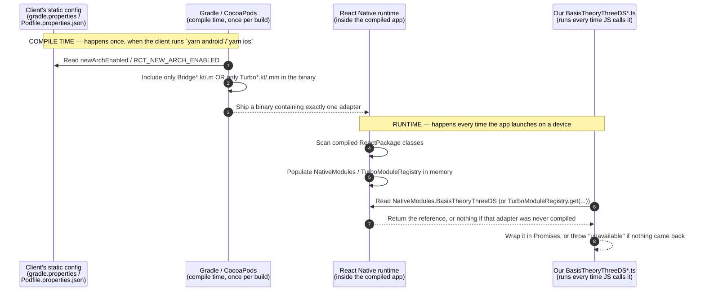
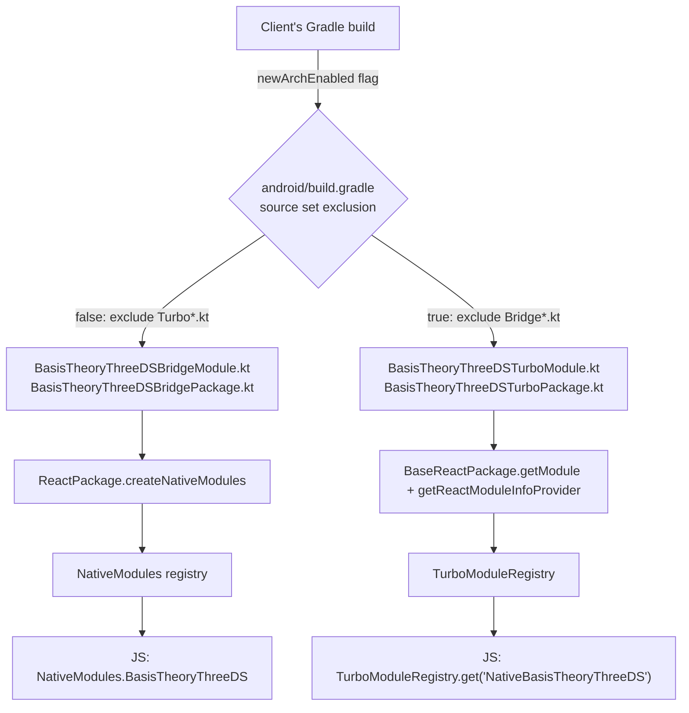
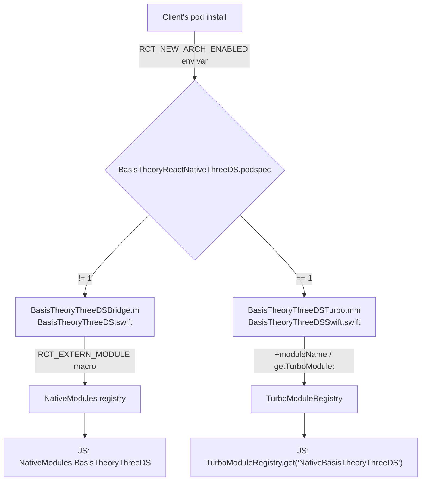
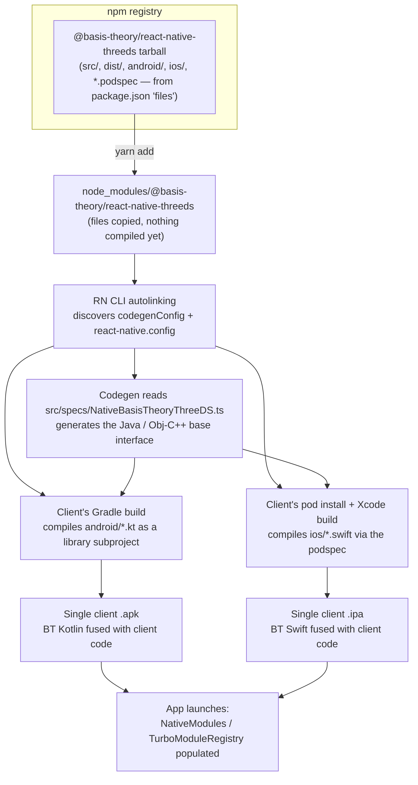

# How native modules get registered, and how the package reaches a client app

This doc answers two different questions that `docs/ARCHITECTURE.md` does not
cover directly:

1. **Registration** — how does a Kotlin/Swift class become something
   `BasisTheoryThreeDSStrategies.ios.bridge.configure(...)` can actually call?
2. **Packaging** — what happens between `yarn add @basis-theory/react-native-threeds`
   and a client's compiled app containing that Kotlin/Swift code?

## Prerequisites: none of this is specific to this package

Everything below relies on tooling and conventions that come from React
Native itself, not from anything this repository invented:

- **Gradle** is Android's build tool (roughly what webpack/npm scripts are for
  JS). Every Android app — RN or not — is compiled by Gradle. This repo does
  not run Gradle; the *client's* app runs it, and our `android/build.gradle`
  is picked up as one more subproject of that build.
- **CocoaPods** is the iOS equivalent: it resolves and compiles native
  dependencies (ours included) into the client's Xcode project via `pod
  install`, driven by our `.podspec`.
- **`newArchEnabled`** (Android, in `gradle.properties`) and
  **`RCT_NEW_ARCH_ENABLED`** (iOS, read from `Podfile.properties.json`) are
  official React Native flags, written automatically by `react-native init`
  or `expo prebuild` into *every* RN app's project files since RN 0.68. They
  are not something this package defines or ships — they already exist in
  any client project before they ever add this package. We only *read* them
  in our build files to decide which adapter to compile (see §1 below).
- **A client always has `android/` and `ios/` folders** once they leave
  Expo Go (i.e. once they run `expo prebuild` or use the bare RN CLI). Those
  folders, and the flags above, are generated by React Native's own tooling,
  not authored by the client and not something this package asks them to
  add. This package only needs those folders to exist so autolinking has
  somewhere to plug into.

## Expo Go vs. a real native build

"Expo" is not one thing — it names three different setups, and only two of
them can ever run our Bridge or TurboModule code:

| Mode | Has its own `android/`/`ios/`? | Runs `pod install` / Gradle for the project's own dependencies? | Can load our Bridge/TurboModule? |
| --- | --- | --- | --- |
| **Expo Go** (scan a QR code with the Expo Go app from the App/Play Store) | No | No — Expo Go is a single generic app, already compiled and published by Expo, shared by every Expo Go user | **No.** Only WebView (`BasisTheoryThreeDSProvider`) works. |
| **Expo dev client / prebuild** (`expo prebuild`, what `poc-examples/bridge` and `poc-examples/turbo-modules` are) | Yes, generated and committed | Yes | Yes — Bridge and/or TurboModule, per the `newArchEnabled`/`RCT_NEW_ARCH_ENABLED` flag |
| **Bare React Native CLI** (`react-native init`, no Expo at all — `poc-examples/turbo-modules-android-bare`) | Yes, generated and committed | Yes | Yes — same as above |

Expo Go is a **single app binary that Expo itself compiles once and publishes
to app stores**, shared by every developer who scans a QR code. Because it is
already compiled before your project even exists, it can only contain the
fixed set of native modules Expo chose to bundle into it ahead of time
(camera, location, and a short list of commonly used third-party libraries —
`react-native-webview` happens to be one of them). It cannot contain *our*
Kotlin/Swift, because nothing about our package existed when Expo built and
published that generic binary.

This maps directly onto the compile-time/runtime split above: **there is no
compile step at all when using Expo Go.** You run `expo start` and Metro
serves JavaScript to an app that was already installed from the store. Our
`android/build.gradle` and `.podspec` never run for your project, so
`BasisTheoryThreeDSBridgePackage`/`...TurboPackage` never get compiled, and
`NativeModules.BasisTheoryThreeDS` never exists in memory — no matter what
`newArchEnabled` says, because that flag is never even read. WebView survives
this because it doesn't need any of our native code to be registered; it's
just a component that was already inside Expo Go's precompiled binary.

## What actually triggers the native compile step

It is easy to assume `yarn android`/`yarn ios` always means "compile and
install the native app," because that is true for a normal client project.
It is worth being precise here because this repository's own POC apps are an
exception:

| App | `yarn android`/`ios` script | What it actually does | What triggers the real native compile |
| --- | --- | --- | --- |
| A normal client app, or `poc-examples/turbo-modules-android-bare` | `react-native run-android` / `run-ios` (or `expo run:android`/`run:ios` in a normal Expo dev-client project) | Compiles with Gradle/CocoaPods, installs, and launches — one command | The command itself |
| `poc-examples/bridge`, `poc-examples/turbo-modules` (this repo) | `expo start --android`/`--ios` | Starts **only Metro** (the JS bundler) — no compile, no install | Manually opening `ios/*.xcworkspace` in Xcode and pressing Run, or opening the project via `./poc-support/scripts/open-android-studio.sh` and pressing Run in Android Studio — see `docs/LOCAL-RUNBOOK.md` |

The underlying mechanism — Gradle/CocoaPods reading the architecture flag and
compiling exactly one adapter — is identical in every row. What differs is
only *which command* triggers that compile step. This repo's Bridge/TurboModules
POC apps use the IDE's Run button instead of a single CLI command because of
extra local complexity documented in `docs/LOCAL-RUNBOOK.md` (a composite
Gradle build against a locally checked-out copy of the Android 3DS SDK,
mismatched AGP versions between hosts, a pinned JDK) — not because that is
how a real client's app would normally work.

## Two different moments: compile time vs. runtime

The most common confusion when reading this doc is treating "which adapter
gets used" as one decision. It is actually two separate decisions, made by
two different actors, at two different times:

The package's own JavaScript (`BasisTheoryThreeDS.ts`,
`BasisTheoryThreeDSTurbo.ts`) never decides which adapter to use. That
decision is already final by the time any JS runs — it was made once, at
compile time, by Gradle/CocoaPods reading a static flag the client's project
already had. Our JavaScript is a passive reader of whatever the React Native
runtime already placed in memory during app startup; it resolves a reference,
it does not create or select one.

## 1. Registration

### Android

**Only one of the two ever gets compiled into a given Android build.**
`android/build.gradle` excludes `*Bridge*.kt` or `*Turbo*.kt` from the source
set at build time, based on the client's `newArchEnabled` Gradle property —
never both. This is not a runtime toggle; it is decided once, when Gradle
compiles the app.

### iOS

Same rule as Android: the podspec's `if ENV['RCT_NEW_ARCH_ENABLED']` branch
picks exactly one `source_files` list. Only one Objective-C/Swift pair is
ever compiled per app.

### Why `BasisTheoryThreeDSStrategies` is still safe with only one adapter compiled

`src/index.tsx` exposes both `bridge` and `turboModule` on both platforms so
a consuming app can choose explicitly. But if the app was built with
`newArchEnabled=false`, the TurboModule Kotlin/Swift never compiled — so
`BasisTheoryThreeDSStrategies.android.turboModule` resolves to a facade whose
native lookup returns nothing. `isThreeDSTurboModuleAvailable()` reports
`false` and calling it throws the actionable error added in
`src/native/BasisTheoryThreeDSTurbo.ts` (see
`docs/ANDROID-TURBOMODULE-INVESTIGATION.md` for why that's expected on
Android regardless of the architecture flag). Nothing crashes — the facade is
a safe no-op path, not a second copy of the native module.

## 2. Packaging: from `yarn add` to a client's compiled binary

Key point for a non-engineering audience: **nothing is precompiled or shipped
as a binary.** npm distributes source (Kotlin, Swift, Objective-C, and the
TypeScript facade). The client's own build tools compile it, at the same time
they compile the client's own app code, into one binary. This is exactly how
`react-native-webview`, `@stripe/stripe-react-native`, and every other native
React Native library ships.

## Where to look for each piece

| Concern | File |
| --- | --- |
| What ships in the npm tarball | `package.json` → `"files"` |
| How Codegen finds the TS contract | `package.json` → `"codegenConfig"` |
| Android build-time adapter selection | `android/build.gradle` |
| iOS build-time adapter selection | `BasisTheoryReactNativeThreeDS.podspec` |
| Public per-platform, per-strategy API | `src/index.tsx` → `BasisTheoryThreeDSStrategies` |
| Bridge JS facade | `src/native/BasisTheoryThreeDS.ts` |
| TurboModule JS facade | `src/native/BasisTheoryThreeDSTurbo.ts` |
| TurboModule TS contract (Codegen input) | `src/specs/NativeBasisTheoryThreeDS.ts` |
